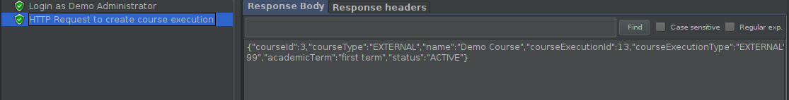
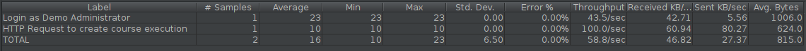
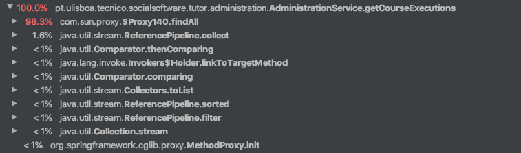
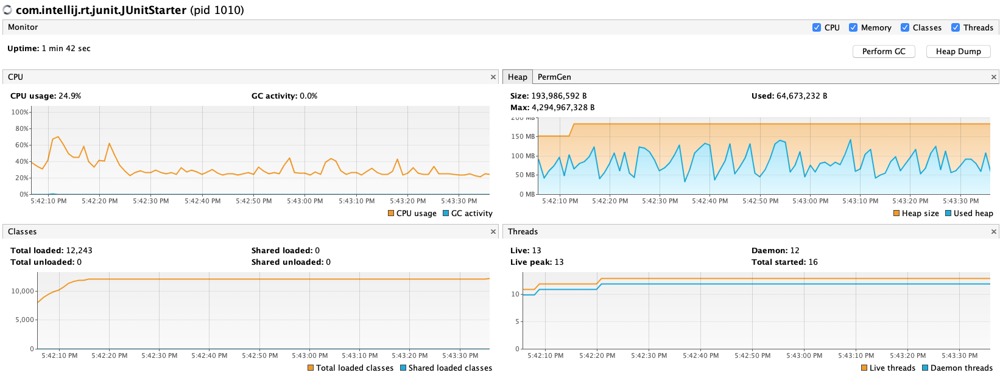
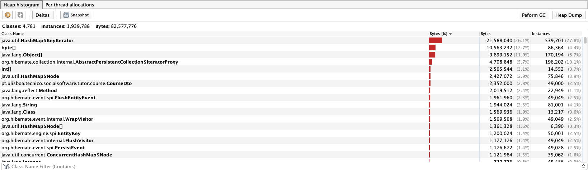

# ES20 P2 submission, Group NN

## Feature PPA

### Subgroup
 - Nome, istID, githubID
   + Issues assigned: [#1](https://github.com), [#3](https://github.com)
 - Nome, istID, githubID
   + Issues assigned: [#2](https://github.com), [#4](https://github.com)
 
### Pull requests associated with this feature

The list of pull requests associated with this feature is:

 - [PR #000](https://github.com)
 - [PR #001](https://github.com)
 - [PR #002](https://github.com)

### Web services definition

#### Controllers
 - [Controller0](https://github.com)
 - [Controller1](https://github.com)

### Feature testing

Each subgroup member defined one reading test and one writing test. The direct links to these are:

 - [ReadingTestJMeter](https://github.com)
 - [WritingTestJMeter](https://github.com)

#### Screenshots of Results Trees and DB cleanup

### Load testing

Each subgroup member defined one reading test and one writing test. The direct links to these are:

 - [ReadingTestJMeter](https://github.com)
 - [WritingTestJMeter](https://github.com)

#### Screenshots of Summary Reports and DB cleanup

### Service profiling

We used the [Async Profiler](https://www.jetbrains.com/help/idea/async-profiler.html).

#### Screenshots of summary reports

#### Discussion of findings

**TODO**: include here a short description of findings (max. 3 sentences). If
you found opportunities for optimization, you can use more than 3 sentences to
describe what you found and how you optimized your code.

---

## Feature DDP

### Subgroup
 - Hugo Martins, 90727, hugomartins11
   + Issues assigned: [#77](https://github.com/tecnico-softeng/es20tg_34-project/issues/77), [#81](https://github.com/tecnico-softeng/es20tg_34-project/issues/81), [#79](https://github.com/tecnico-softeng/es20tg_34-project/issues/79), [#84](https://github.com/tecnico-softeng/es20tg_34-project/issues/84), [#85](https://github.com/tecnico-softeng/es20tg_34-project/issues/85), [#80](https://github.com/tecnico-softeng/es20tg_34-project/issues/80)
   
 - Pedro Monteiro, 90765, ErisBot
   + Issues assigned: [#78](https://github.com/tecnico-softeng/es20tg_34-project/issues/78), [#81](https://github.com/tecnico-softeng/es20tg_34-project/issues/81), [#82](https://github.com/tecnico-softeng/es20tg_34-project/issues/82), [#83](https://github.com/tecnico-softeng/es20tg_34-project/issues/83), [#85](https://github.com/tecnico-softeng/es20tg_34-project/issues/85)
 
### Pull requests associated with this feature

The list of pull requests associated with this feature is:

 - [PR #000](https://github.com)

### Web services definition

#### Controllers
 - [ClarificationAnswerController](https://github.com/tecnico-softeng/es20tg_34-project/blob/DdP/backend/src/main/java/pt/ulisboa/tecnico/socialsoftware/tutor/clarificationanswer/ClarificationAnswerController.java)
 - [ClarificationRequestController](https://github.com/tecnico-softeng/es20tg_34-project/tree/DdP/backend/src/main/java/pt/ulisboa/tecnico/socialsoftware/tutor/clarificationrequest)

### Feature testing

Each subgroup member defined one reading test and one writing test. The direct links to these are:

 - [ReadingTestJMeter](https://github.com)
 - [WritingTestJMeter](https://github.com)

#### Screenshots of Results Trees and DB cleanup

### Load testing

Each subgroup member defined one reading test and one writing test. The direct links to these are:

 - [ReadingTestJMeter](https://github.com)
 - [WritingTestJMeter](https://github.com)

#### Screenshots of Summary Reports and DB cleanup

### Service profiling

We used the [Async Profiler](https://www.jetbrains.com/help/idea/async-profiler.html).

#### Screenshots of summary reports

#### Discussion of findings

**TODO**: include here a short description of findings (max. 3 sentences). If
you found opportunities for optimization, you can use more than 3 sentences to
describe what you found and how you optimized your code.

---

## Feature TDP

### Subgroup
 - Nome, istID, githubID
   + Issues assigned: [#1](https://github.com), [#3](https://github.com)
 - Nome, istID, githubID
   + Issues assigned: [#2](https://github.com), [#4](https://github.com)
 
### Pull requests associated with this feature

The list of pull requests associated with this feature is:

 - [PR #000](https://github.com)
 - [PR #001](https://github.com)
 - [PR #002](https://github.com)

### Web services definition

#### Controllers
 - [Controller0](https://github.com)
 - [Controller1](https://github.com)

### Feature testing

Each subgroup member defined one reading test and one writing test. The direct links to these are:

 - [ReadingTestJMeter](https://github.com)
 - [WritingTestJMeter](https://github.com)

#### Screenshots of Results Trees and DB cleanup

### Load testing

Each subgroup member defined one reading test and one writing test. The direct links to these are:

 - [ReadingTestJMeter](https://github.com)
 - [WritingTestJMeter](https://github.com)

#### Screenshots of Summary Reports and DB cleanup

### Service profiling

We used the [Async Profiler](https://www.jetbrains.com/help/idea/async-profiler.html).

#### Screenshots of summary reports

#### Discussion of findings

**TODO**: include here a short description of findings (max. 3 sentences). If
you found opportunities for optimization, you can use more than 3 sentences to
describe what you found and how you optimized your code.

